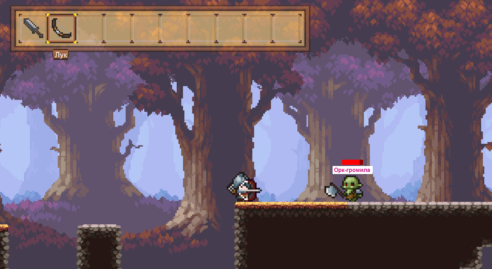
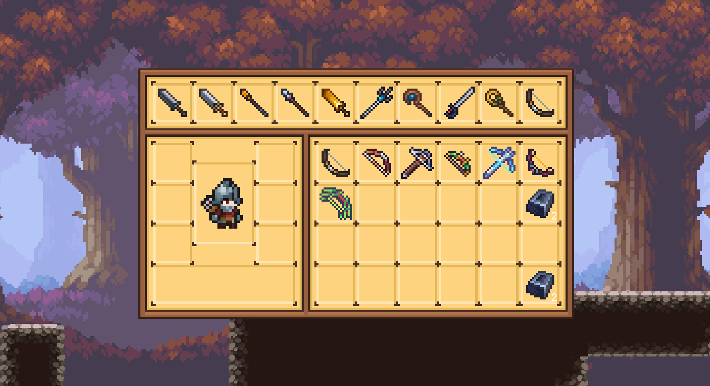
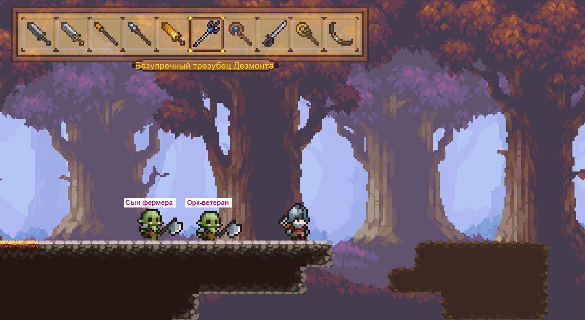
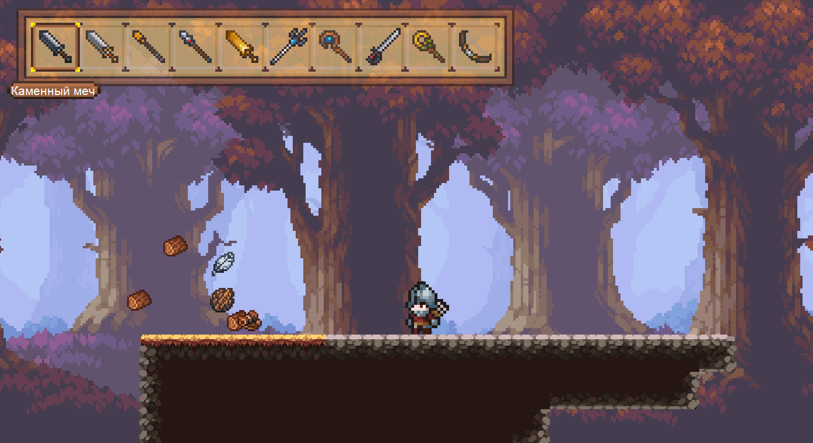

# Simple Platformer Game

## Description
This is a small platformer game developed in C# using WinForms. It was created for educational purposes to practice programming fundamentals, object-oriented design, and application structure.

## Features
- Player movement and jump mechanics
- Collision detection with platforms
- Game loop and input handling
- Attack with left-click
- Open inventory with tab
- The game has many different items without functionality. In the future, they will be used to craft weapons, accessories, armor, etc.

## Screenshots

## Technologies
- C#
- .NET
- Windows Forms

## How to Run
1. Open the project in Visual Studio
2. Build the solution
3. Run the game (F5)

## Purpose
The project was created to:
- Learn and practice C# syntax
- Apply object-oriented programming principles
- Structure code in a maintainable way
- Gain experience with small game development

